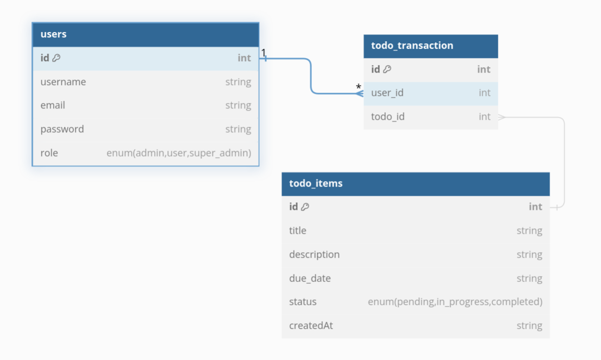

# todo-list

## Database Relationship


## Railway
```properties
spring_profile_active=prod
PROD_DB_HOST=postgres.railway.internal
PORD_DB_PORT=5432
PORD_DB_NAME=railway
PORD_DB_PASSWORD=JCMaOeYpITuxtgWDyVHAopZKOQizTRPW
PROD_DB_USERNAME=postgres
```
